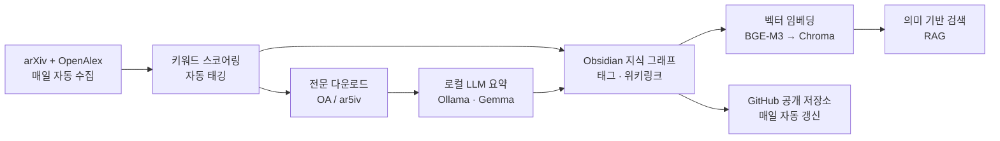

# Research Paper Automation Pipeline

논문 리서치의 반복 작업을 자동화한 개인 파이프라인입니다. **매일 최신 논문을 자동 수집 → 로컬 LLM으로 요약 → 지식 그래프로 구조화 → 벡터 DB에 임베딩하여 의미 기반 검색(RAG)** 까지, 데이터 수집부터 지식 활용까지 하나의 흐름으로 연결했습니다. 도메인은 **오디오 딥페이크 탐지(Audio Deepfake Detection)** 연구입니다.

> 이 저장소는 개인 연구용 시스템(Obsidian 기반 research-vault)에서 **파이프라인 코드만 발췌·정리**한 것입니다. 개인 연구 노트·vault 내용은 포함하지 않습니다.

---

## 자동화 흐름



## 자소서 문장 ↔ 코드 매핑

| 주장 | 구현 | 핵심 기술 |
|---|---|---|
| **최신 논문 자동 수집** | [`collect/daily_digest.py`](collect/daily_digest.py) | arXiv API 1차 + **OpenAlex 폴백**(rate-limit 시), HTTP 429 fail-soft·재시도, Windows Task Scheduler cron |
| **로컬 LLM 요약** | [`summarize/`](summarize/) — [`paper_summary.py`](summarize/paper_summary.py), [`enrich_new_papers.py`](summarize/enrich_new_papers.py) | Ollama · Gemma, **비용 0**, 프롬프트 인젝션 방어(untrusted 격리), 캐시 |
| **지식 그래프 구조화** | 규칙 기반 자동 태깅([`daily_digest.py`](collect/daily_digest.py) `write_source_note`) → Obsidian 그래프 | 태그 계층(`research/add/*`) + 위키링크 그래프 · *(그래프 스크린샷은 아래 참고)* |
| **벡터 DB + RAG** | [`search_rag/index_vault.py`](search_rag/index_vault.py), [`ask_vault.py`](search_rag/ask_vault.py) | **BGE-M3** 임베딩 + **Chroma** 벡터 DB, 증분 인덱싱(mtime), 로컬 완결 |
| **수집→활용 완성** | [`export/`](export/) — [`export_papers_repo.py`](export/export_papers_repo.py), [`sync_repos.py`](export/sync_repos.py) | 자동 export + **leak-guard(fail-closed)** + git 자동 커밋·push |

## 실제 산출물 (자동화 증빙)

이 파이프라인이 **매일 자동으로 갱신**하는 공개 논문 저장소:
👉 **[audio-deepfake-detection-papers](https://github.com/woongja/audio-deepfake-detection-papers)**

커밋 히스토리가 매일 자동 갱신되는 것을 확인할 수 있습니다(automation 증빙). 일부 논문은 로컬 LLM이 생성한 요약 페이지(`summaries/`)로 링크됩니다.

> ⚠ 요약은 로컬 LLM 자동 생성물로 **검증되지 않았습니다** — 원문 확인 필요(신뢰 티어 분리, [ARCHITECTURE.md](ARCHITECTURE.md) 참고).

## 엔지니어링 포인트

설계 판단은 [**ARCHITECTURE.md**](ARCHITECTURE.md)에 정리했습니다 — 단일 소스 취약성과 다중 소스 fail-soft, 신뢰 3티어(검증 안 된 LLM 생성물 격리), 비용 0 로컬 LLM 티어, 무의존(stdlib) 설계, 멱등성.

## 구성

```
collect/      논문 자동 수집 (arXiv + OpenAlex, stdlib only)
summarize/    전문 다운로드 + 로컬 LLM 요약 (Ollama)
search_rag/   벡터 임베딩 인덱싱 + 의미 기반 검색 (BGE-M3 + Chroma)
export/       공개 저장소 자동 생성 + git 동기화 (leak-guard)
```

## 실행

```bash
export RESEARCH_VAULT=/path/to/your/vault      # 노트가 저장된 루트
export OPENALEX_MAILTO=you@example.com         # (선택) OpenAlex polite pool
pip install -r requirements.txt                # markitdown, sentence-transformers, chromadb

python collect/daily_digest.py                 # 수집 → 노트 생성 → export
python search_rag/index_vault.py               # 벡터 인덱스 증분 갱신
python search_rag/ask_vault.py "질문"          # RAG 검색
```

수집(`collect/`)과 export(`export/`)는 Python 표준 라이브러리만 사용합니다. 요약은 [Ollama](https://ollama.com) + 로컬 모델(기본 `gemma3n`)이 필요합니다.

## TODO (증빙 보강)

- [ ] Obsidian 지식 그래프 스크린샷 추가 (`docs/graph.png`) — 그래프 구조는 코드가 아닌 시각 자료로 증빙됨

## License

MIT
